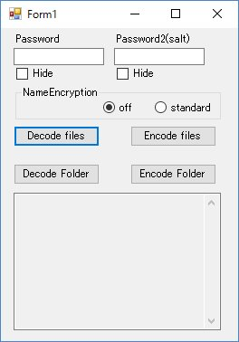

# DecodeRclone
Decode Rclone encrypted files on local

## Overview
Encrypt/decrypt application compatible with [Rclone](http://rclone.org/ "Rclone") encrytion method

## Description
Decrypt [Rclone](http://rclone.org/ "Rclone") encryted files on local. 
You can decode encrypted files downloaded without Rclone.

## Requirement
This application is compiled with c# .NET 4.5.2.
Your system doesn't have the Microsoft .NET Framework 4.5.2, please install following link.
<https://www.microsoft.com/ja-JP/download/details.aspx?id=42643>

## How to use
* select files/folder with "decode files" or "decode Folder" button
* Drag&Drop encrypted items to appliction window

output decorded files to the same place of encrypted ones
